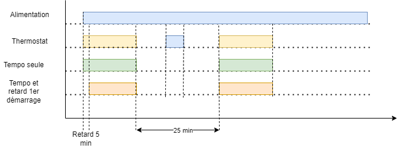
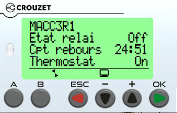

# Relai temporisé MACC3R1 Crouzet

Ce relai MACC3R1 n'étant plus fabriqué, il est possible de proposer une alternative à base de petit automate. Le Crouzet [Millenium Slim](https://soda.crouzet.com/pn/?i=88983903) est parfait pour cela. Il est utilisé pour les PAC (Pompes à Chaleur).

## Fonctionnalités du programme

Le programme existe en deux variantes : 
- relai de redémarrage temporisé (25 min)
- relai de redémarrage temporisé (25 min), activation du relai 5 minutes après la mise sous tension initiale

La seconde variante suppose que la PAC ne peut pas démarrer dans les 5 minutes qui suivent sa remise sous tension. C'est pour éviter le pic de courant après une coupure gérénale et laisse au réseau le temps de se stabiliser avant de lancer la PAC.

Via un écran virtuel (application iPhone et Android), il est possibile de visualiser 
- Etat du relai
- Etat de l'entrée du thermostat
- Compte à rebours
- Mise à zéro du compte à rebours - bouton A
- Relancer le délai à la mise sous tension - bouton B

## Diagramme de fonctionnement

## Schéma de cablâge

## Vue de l'écran

Via l'[écran virtuel Crouzet](https://www.crouzet.com/produits/controleurs-automatisme/software/crouzet-virtual-display/)  

## Chargement du programme

Pour charger le programme il est nécessaire d'avoir 
- Un millenium SLim 230V alimenté
- Le logiciel Crouzet Soft
- Le programme (fichier *.pcs) de ce dépôt

Chargement  
- Ouvrir le programme depuis Crouzet Soft
- Sans le menu contrôleur> connexion sélectionnez Bluetooth
- Sélectionner votre Millenuim Slim dans la fenêtre de configuration

## Modification du programme

A votre convenance, pour modifier les temporisations.  
Une évolution possible est de remplacer le thermostat puisque les entrées restantes peuvent accueillir une sonde de température.  
Vous avez la main ...

