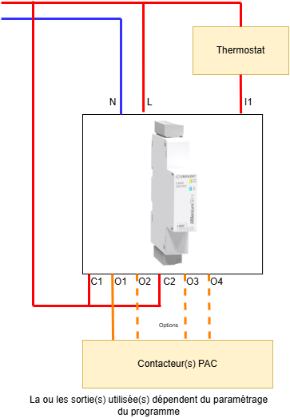

# Relai temporisé MACC3R1 Crouzet

Ce relai MACC3R1 n'étant plus fabriqué, il est possible de proposer une alternative à base de petit automate. Il est utilisé pour les PAC (Pompes à Chaleur). Le relai MACC3R1 existe en plusieurs versions : 
- MACC3R1 SP 05039 - 88826867 - Délai de redémarrage de 25 minutes
- MACC3R1 SP 08001 - 88826890 - Délai de redémarrage de 3 minutes avec délai de 5 secondes à chaque démarrage

ACC = Anti Cycle Court

Il est utilisé dans les PAC Sofath par exemple.  
Toutes ces versions peuvent être gérées par l'automate Crouzet [Millenium Slim](https://soda.crouzet.com/pn/?i=88983903).

## Diagramme de fonctionnement

- T1: délai au premier démarrage (gestion de coupure EDF)
- T2: délai à chaque démarrage
- T3: temporisation de redémarrage

## Fonctionnalités du programme V2

Cette version du programme permet de gérer l'ensemble des paramètres depuis l'[écran virtuel Crouzet](https://www.crouzet.com/produits/controleurs-automatisme/software/crouzet-virtual-display/). Les fonctionnalités proposées sont :
- Visualisation de l'état du relai (délai en cours, commande en cours, prêt)
- Visualisation de l'état de la commande
- Visualisation de l'état des sorties
- Boutons haut et bas pour faire défiler les écrans
- Boutons OK pour entrer en mode édition, haut / bas pour modifier, OK pour valider, ESC pour retour à l'écran principal
- Bouton B (appui long) pour remettre à zéro les temporisations en cours (retour à l'état "prêt").
- Paramétrage du délai de premier démarrage T1 (0 - 600s) 
- Paramétrage du délai à chaque démarrage T2 (0 - 9h)
- Paramétrage du délai avant le redémarrage T3 (0 - 9h)
- Paramétrage de l'usage de chaque sortie (gestion des 4 sorties)

La version V2 est une refonte complète du programme. Elle apporte plus de simplicité en proposant tous les paramétrages depuis l'écran virtuel. Plus besoin de modifier le programme. Les versions précédentes sont dans le dossier `old`

## Schéma de cablâge

## Chargement du programme

### Pour charger le programme il est nécessaire d'avoir
- Un millenium SLim 230V alimenté
- Le logiciel [Crouzet Soft](https://www.crouzet.com/softwares/download) gratuit - v1.12 ou supérieure
- Le programme, fichier *.pcs

### Chargement

- Ouvrir le programme depuis Crouzet Soft
- Dans le menu contrôleur > connexion sélectionnez Bluetooth
- Sélectionner votre Millenuim Slim dans la fenêtre de configuration
- Lancez la simulation si nécessaire
- Injecter le programme via le bouton d'écriture

## Modification du programme

Tout est modifiable selon votre besoin.  
Une évolution possible est de remplacer le thermostat puisque les entrées restantes peuvent accueillir une sonde de température.  
Toute autre modification...  

Le programme fonctionne aussi sur les autres automates Crouzet, c'est le même logiciel de programmation.

