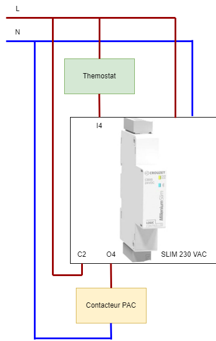

# Timed relay MACC3R1 Crouzet

This device is not manufactured anymore. Used is heat pumps, it has 2 variants.  

- MACC3R1 SP 05039 - 88826867 - 25 min restart delay
- MACC3R1 SP 08001 - 88826890 - 5s staring delay and 3 minutes retstart delay

Used in Sofath's heat pumps  
It can be replaced by a small controller Crouzet [Millenium Slim](https://soda.crouzet.com/pn/?i=88983903).

## Working diagram

- T1: 1st startup delay (just after main outage for instance)
- T2: startup delay
- T3: retstart delay

## Implemented features

### Virtual screen version

Only one timer with all 3 timers settable while loading program in controller's memory. Use in this case `Slim_Timer_ACC3_SPxxxxx_ecran.pcs`. 

The [Crouzet's virtual display](https://www.crouzet.com/produits/controleurs-automatisme/software/crouzet-virtual-display/) provides the following

- Output relay state
- Input thermostat state
- Restart timer decounting
- Reset restart timer - A button
- Reset the whole system (including 1st startup delay)

### 4 timers without display

This version provides 4 variants of the timer selected by the input / output selection. ALl 4 timers are working independantly.

| Mode                  | Input | Output |  T1 | T2 |   T3  |
|-----------------------|:------:|:------:|:---:|:--:|:-----:|
| SP08001               |   I1   |   O1   |  0s | 5s |  3min |
| SP08001 1er démarrage |   I2   |   O2   | 60s | 5s |  3min |
| SP05039 1er démarrage |   I3   |   O3   | 60s | 0s | 25min |
| SP05039               |   I4   |   O4   |  0s | 0s | 25min |

## Wiring diagram
Valid for display version software. By its principle is the same for the 4 tilers version.

## Program loading

### Prerequisite
- One Millenium Slim 230V powered on
- [Crouzet Soft](https://www.crouzet.com/softwares/download) software - free - 1.12 version minimum
- The source file (selected .pcs file)

### Timers setting

__Display version__ 

- T1: Block B61 : 1st startup, in seconds
- T3: Block B24 : restart delay, in hours, minutes & seconds
- T2: Block B60 : startup delay, tenth of seconds

Check out the [PDF](./res/Slim_Timer_ACC3_Universel.pdf), page 2, for blocks schematics

__Without display version__

No need to modify something. The feature selection is based on the input/outpout choices

### Loading ...

- Open the pcs file with Crouzet Soft
- Inthe meu Controller > Connection select the Bluetooth option
- Select your Milenium Slim device
- Start simulation if needed
- Write the program to device's memory

## Program adaptation

Feel free to do it to meet your needs.
